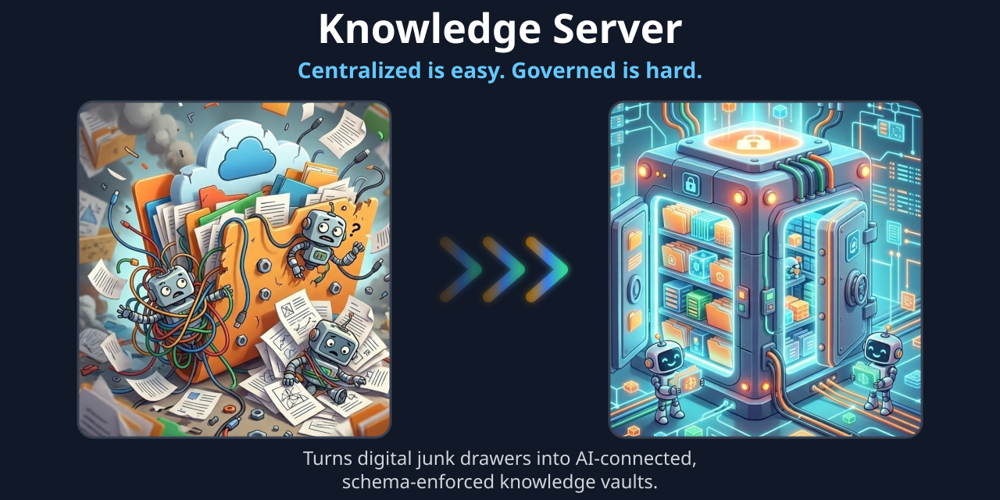
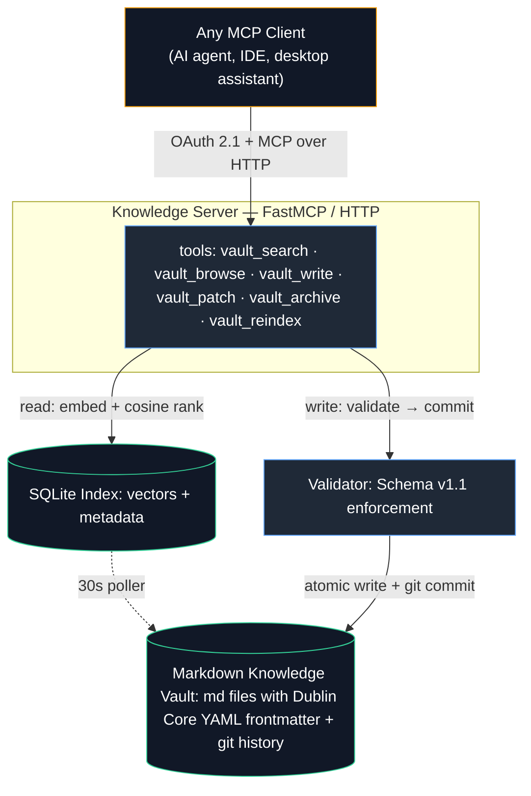
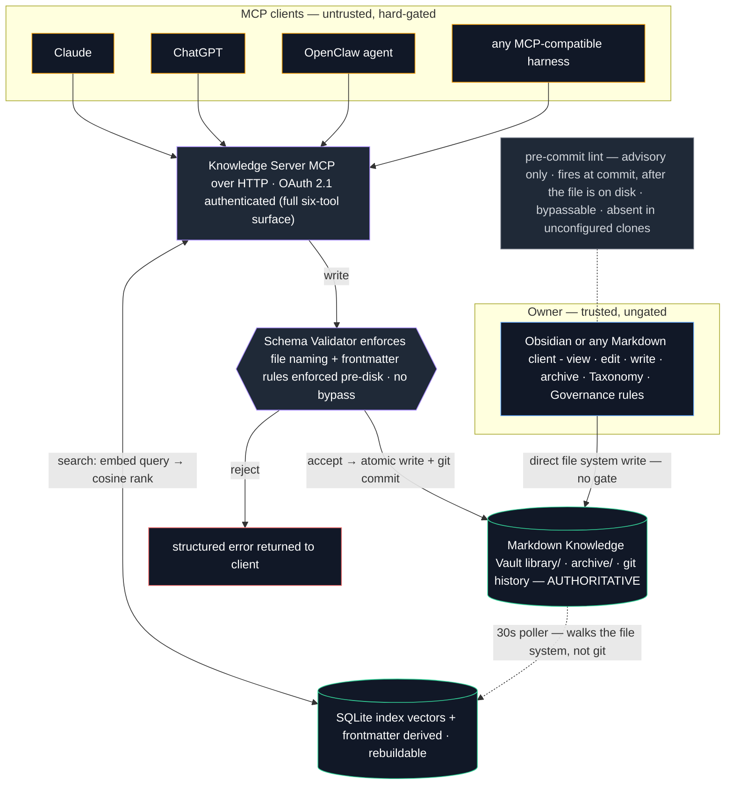

# Knowledge Server



I had so many files strewn across who knows how many AI systems – Claude, ChatGPT, Gemini, OpenClaw, etc. My personal and project data was in bits and pieces, and I was tied to a specific service if I wanted to work on Project A and have it track progress, and I’d have to switch to another service if I wanted to talk about subject Z and have it remember where we left off, where we were headed, etc. So, I decided to decouple my collected knowledge from the AI harness and centralize it, pointing multiple agents at one data store so no matter what AI tool I was using, it had access to the same knowledge.

Why not just connect to Google Drive? Because I didn’t want to merely centralize data, I wanted to govern it. An ungoverned shared folder like Google Drive that agents can access is where institutional knowledge goes to die. It becomes a digital junk drawer. Give three different AI agents loose write access to a Google Drive folder, and within a week you don’t have a second brain—you have duplicate notes, half-baked brainstorms masquerading as canonical specs, conflicting timelines, and zero provenance. I wanted a system where knowledge has rules: strict frontmatter schemas enforced at the write boundary, immutable identifiers, explicit status tracking (active, superseded), and atomic archiving so history is never silently overwritten.

That’s why I built the Knowledge Server.

It’s a contract-driven vault built for both agents and humans, by a human who refuses to let his second brain rot. It speaks the Model Context Protocol out of the box, connecting Claude, OpenClaw, and any future model to a single, structured source of truth—while keeping the intelligence entirely decoupled from the data store.

I still rent the AI, but I own my data – and it’s clean.

## What's in the box: 

Model Agnostic Freedom: Swap your AI harness tomorrow. Use Claude today, OpenClaw tomorrow, or both at the same time or whatever model drops next week. Your notes stay yours, living in plain markdown on a git-backed server.

Agent Governance by Default: Strict schemas ensure every agent writes clean, structured, searchable data. No rogue formats, no orphaned files, no drift.

Semantic Search Meets Structured Browsing: A standard folder search is dumb—it just matches keywords and leaves you drowning in a sea of irrelevant text hits. The Knowledge Server pairs high-precision semantic search with structured, hierarchical vault browsing. You don't just find a random fragment; the system surfaces the exact conceptual chunk and lets you traverse the complete, related note context instantly. It’s the difference between blindly Ctrl+F'ing through a filing cabinet and having a librarian who instantly hands you the exact document, open to the right paragraph.

Self-Healing & Versioned History: Atomic operations and explicit states (active, superseded) mean your second brain retains its history without rotting into a junk drawer.

Plug-and-Play MCP Integration: Connects seamlessly to your AI surfaces out of the box with zero bespoke plumbing.

Coming soon: The Bouncer for Human Messiness
What happens when those pesky humans start hand-editing documents and forget to follow the knowledge management rules? We’re building automated vault hygiene: background sweeps that scan the corpus for non-compliant frontmatter, broken schemas, or drifted notes, and gracefully work with you (or your agents) to correct them before entropy wins.

## Use with caution, but please use it.

This repo is an architectural reference. Since everyone’s environments differ, use it to guide you through your own implementation. Read on for more details.

# Centralized AI Knowledge Server/Vault

**An AI-connected, centralized, harness-agnostic semantic knowledge/memory store.** This basic knowledge system is a governed Markdown vault, exposed to any AI agent over the [Model Context Protocol (MCP)](https://modelcontextprotocol.io), with documentation standards enforced at write time rather than hoped for at read time. 

The purpose of this system is to allow a user to keep a centralized, long-term memory store that is easily maintainable and is accessible to one or many AI agents. Connect it to Claude, ChatGPT, OpenClaw, etc and each will instantly have access to your second brain. Each agent will read from and write to the store in the same manner using industry standard knowledge management practices. The knowledge server and vault provide a way of structuring machine-maintained knowledge so that an AI system does not merely *store and recall* text, but operates over a corpus whose **meaning, provenance, and lifecycle are explicit and machine-checkable.** 


---

## The idea in one paragraph

I wanted an AI-driven second brain to store information I care about and to help me organize/utilize that information. Second, I wanted this brain to be usable by both a human and by a machine. Third, I wanted to be able to access this second brain from anywhere and attach various AI agents to it. Lastly, I wanted this to be more than just a search tool of a knowledge store. I wanted to take steps toward a *robust comprehension* via knowledge management. Most "give your AI a memory" systems are a vector database and a similarity search. That gives you *recall* but not *comprehension*. This knowledge server takes the standard RAG ability to fetch text that looks like your query and it adds the ability to know which document is authoritative, which has been superseded, what kind of artifact each one is, or how they relate. Recall without governance rots: the index fills with contradictory, stale, and duplicative material, and retrieval quality degrades as the corpus grows. This project treats that as an **architecture problem, not a model-capability problem.** It puts a thin, enforced **semantic layer** -- a controlled vocabulary, a metadata ontology, and a lifecycle model -- *above* the vector index, so that retrieval is grounded in declared meaning, not just geometric proximity.

This version is a start toward AI agents better comprehending stored knowledge. For the full argument, see **[docs/KNOWLEDGE-MODEL.md](docs/KNOWLEDGE-MODEL.md)** — that document is the heart of this repository.

---

## Why this exists

RAG has a well-known failure mode often called **context rot**. As a knowledge base accumulates, semantic search increasingly returns material that is *similar* but *wrong for the moment* -- an obsolete runbook, a decision that was later reversed, an early draft alongside its final version. Because a bare embedding index has no concept of authority or time, it cannot prefer the current truth over a well-phrased ghost.

The usual reflex is to reach for a more capable model. That does not fix it. Inconsistent structure across documents is not something a larger model repairs; it is a gap in the *system's* design. The solution is to make structure and status **first-class, enforced properties of every document** — and to enforce them at the moment of writing, so that malformed or unclassifiable knowledge can never enter the corpus in the first place.

---

## Core thesis: governance above vector RAG

Two layers, cooperating:

1. **The vector layer (recall).** Documents are chunked and embedded; queries retrieve by cosine similarity. This is a geometric proxy for *meaning* — it finds text that is semantically near the query. Necessary, but insufficient.

2. **The governed semantic layer (comprehension).** Every document carries typed, validated metadata drawn from an established vocabulary. This layer answers the questions the vector layer cannot:
   - *What kind of thing is this?* — a controlled `type` (`decision`, `runbook`, `reference`, …).
   - *Is it still true?* — a controlled `status` lifecycle (`draft` → `active` → `superseded`).
   - *Where did it come from, and what does it relate to?* — `source` and `relation` provenance fields.

Search defaults to **current knowledge only** — superseded material is retained (for audit and explicit recall) but excluded from ordinary retrieval. That single governed field, `status`, is the structural answer to context rot.

---

## Standards it leans on

This project deliberately reuses established vocabularies rather than inventing bespoke ones, so the vault stays interoperable and has a clean upgrade path toward formal linked data.

- **[Dublin Core](https://www.dublincore.org/specifications/dublin-core/dcmi-terms/) metadata terms** — `title`, `type`, `subject`, `date`, `source`, `relation`. An established, RDF-compatible vocabulary. Using its field names means any note can later be projected into JSON-LD / YAML-LD **without a field-renaming migration** if a formal knowledge-graph layer is ever added.
- **Controlled vocabularies** — the `type` and `status` fields draw from small, fixed, queryable sets rather than free text. An unconstrained field defeats the purpose of having one.
- **Model Context Protocol (MCP)** — the vault is exposed as MCP tools, so it is *harness-agnostic*: any current or future agent framework connects the same way, over the same wire protocol, with no bespoke integration.
- **Semantic chunking** — documents are split on heading structure with bounded overlap, so retrieved chunks are coherent units rather than arbitrary character windows.

See **[docs/VAULT-SCHEMA.md](docs/VAULT-SCHEMA.md)** for the exact field contract.

---

## Architecture at a glance



<p align="center"><i>Embeddings: local Ollama (`mxbai-embed-large`). Similarity computed in-process via numpy. No external vector DB, no data leaves the host.</i></p>   


Two independent paths meet at the vault:

- **Read path** — a query is embedded, ranked by cosine similarity against the SQLite index, and filtered by governed metadata. A background poller keeps the index fresh (~30s worst-case staleness); no manual reindex is required.
- **Write path** — every write is validated against the schema *before* anything touches disk, then written atomically and recorded as a single git commit. Invalid content is rejected with a structured, machine-actionable error. See below.

---

## Controls on write: correctness by construction

The vault cannot be corrupted by careless or malformed writes, because the write tools refuse them. `vault_write`, `vault_patch`, and `vault_archive` all compose the same two pure validators (path rules + content/schema rules) with filesystem-safe I/O:

- **Schema enforcement.** Content must begin with a well-formed YAML frontmatter block containing every required field: `title`, `type`, `created`, `subject`, `relation`, `source`, `status`, plus (Schema v1.1) `identifier`, `creator`, `reviewed`, `reviewed_by`, `schema`. `type`/`status`/`creator`/`reviewed_by` must be members of their controlled vocabularies; `created`/`reviewed` must be ISO dates; `identifier` must be a canonical UUIDv7; `subject` and `relation` must be string lists; the body must be non-empty. See [docs/VAULT-SCHEMA.md](docs/VAULT-SCHEMA.md) for the full contract.
- **Path discipline.** Writes are constrained to a designated writable subtree. Filenames and directory segments must be lowercase kebab-case; an optional dotted-semver suffix (e.g. `-v1.2`) supports explicit document versioning. Absolute paths, `..` traversal, and (via the writer's real-root resolution) symlink escapes are all rejected.
- **Two-phase, human-in-the-loop writes.** Callers are expected to invoke `dry_run=true` first: this returns the full validation report and — when creating, overwriting, patching, or archiving — a unified diff, **without mutating anything.** A real write happens only after explicit approval. Agents do not write to the vault unprompted.
- **Versioned, attributed history.** Every successful write is a single git commit with a fixed author identity, and the originating client is recorded in the commit message body. The corpus is fully auditable; nothing is lost, only superseded — `vault_archive` moves a note with `git mv`, preserving its history at the new path.
- **Structured, per-call audit log.** Independent of the git commit trail, every tool call — reads included — is wrapped in a logging decorator that records a JSONL line (client, tool, outcome, duration, detail) to a rotating log file. Git history says what changed; the tool log says who called what, whether it succeeded, and how long it took.

The result is *correctness by construction*: the only way to get a document into the vault is to produce one that satisfies the ontology. Structure is not a convention the model is asked to follow — it is an invariant the system enforces.

---

## The MCP tools

| Tool | Purpose |
|---|---|
| `vault_search` | Semantic search over current knowledge; filterable by `type`/`status`; superseded material excluded by default. |
| `vault_browse` | List indexed notes with their metadata, or read one note in full. |
| `vault_write` | Validated, versioned create/overwrite. `dry_run` returns a report + diff without mutating. |
| `vault_patch` | Targeted string-replacement edit of an existing note. Exact-one-match only; identifier is immutable. |
| `vault_archive` | Move a note `library/` → `archive/` via `git mv`, setting `status` atomically. |
| `vault_reindex` | On-demand index rebuild (rarely needed; the poller handles freshness). |

Every tool call — read or write — passes through a structured logging decorator (`ks/logging_config.py`) that emits one JSONL line per call: originating client, tool name, outcome, duration, and a tool-specific detail payload. This is the audit trail for *usage*, distinct from the git commit trail that records *content changes*.


<p align="center"><i>The vault runs an asymmetric trust model. MCP clients are untrusted: every write passes a server-side Schema v1.1 validator before it reaches disk, and every client must complete OAuth 2.1 authentication before any tool call succeeds. No harness holds filesystem access to the vault.</i></p>

<p align="center"><i>The owner is trusted and ungated. Edits from a Markdown client land directly on disk. The pre-commit lint is a courtesy check, not an enforcement boundary: it fires at commit time (after the file is already written), is bypassable, and is inactive in clones that have not configured `core.hooksPath`. This is deliberate — lifecycle operations the schema cannot express, such as archiving, taxonomy changes, and edits to the governance rulebook itself, have to remain possible.</i></p>

<p align="center"><i>The Markdown files are authoritative. The SQLite index is a derived, rebuildable cache, refreshed by a poller that walks the filesystem rather than git history.</i></p>

---

## Screenshots of Claude Using the Knowledge Server

These screenshots show the MCP connection in Claude app settings, a request from me for a demonstration of search and browse capabilities, and Claude Sonnet 5 output. 


---

## Quickstart

> This repository is a **reference architecture**, not a turnkey appliance. It assumes a reader who is comfortable operating their own host, embedding runtime, and (for public exposure) reverse proxy / tunnel and identity setup. A well-prompted systems-architect persona should be able to read this repo and fill in the environment-specific details.

Prerequisites: Python 3.12+, [`uv`](https://docs.astral.sh/uv/), and [Ollama](https://ollama.com/) with an embedding model pulled.

```bash
# 1. Embedding runtime
ollama pull mxbai-embed-large

# 2. Configuration — copy the example and edit the two marked values
cp ks/config.example.py ks/config.py
#    edit PUBLIC_HOSTNAME and GIT_AUTHOR_EMAIL

# 3. Auth secret (scrypt passphrase + JWT signing key, mode 600)
uv run python -m ks.setpass

# 4. Point VAULT_DIR at a git-initialized Markdown vault, then run
uv run python -m ks.server
```

The server binds loopback only. See **[docs/DEPLOYMENT.md](docs/DEPLOYMENT.md)** for the public-ingress shape (tunnel + OAuth).

---

## Deployment shape (public ingress)

For exposure beyond localhost, the intended shape is:

- **Reverse proxy / tunnel** (e.g. a Cloudflare Tunnel) terminating TLS at a public hostname and forwarding to the loopback-bound server. The server never binds a public interface directly.
- **OAuth 2.1** (PKCE + Dynamic Client Registration) as the authorization server, embedded in the process. Access tokens are stateless HS256 JWTs; refresh tokens and authorization codes are opaque and DB-stored. A passphrase-gated consent screen gates client authorization.

The specifics of *your* hostname, certificate, and tunnel are yours to supply — this repo gives the shape and the working auth server, not a copy of anyone's infrastructure.

---

## Roadmap: from vault to knowledge graph

The metadata model is chosen so that the natural next step is *additive*, not a rewrite. Because the frontmatter already uses Dublin Core (RDF-compatible) field names, each note can be projected into JSON-LD / YAML-LD and lifted into a formal **knowledge graph** — typed entities (nodes) and typed relationships (edges) governed by a single **ontology**, reusing `schema.org` vocabulary where it already covers a concept and extending only where it does not. That unlocks multi-hop relational queries a document search cannot answer directly. This is recorded as a design direction, not a current commitment; the schema is verified compatible with it before either is built further. See **[docs/ROADMAP.md](docs/ROADMAP.md)** and **[docs/KNOWLEDGE-MODEL.md](docs/KNOWLEDGE-MODEL.md) §8**.

---

## Repository layout

```
knowledge-server/
├── README.md
├── pyproject.toml            # 5 deps: httpx, mcp, numpy, pyjwt, pyyaml
├── .gitignore                # secrets, live config, databases — never committed
├── docs/
│   ├── KNOWLEDGE-MODEL.md     # ★ the theory: why governance beats bare RAG
│   ├── VAULT-SCHEMA.md        # the Dublin Core frontmatter contract
│   ├── ARCHITECTURE.md        # component + data-flow reference
│   ├── DEPLOYMENT.md          # tunnel + OAuth shape
│   └── ROADMAP.md             # knowledge-graph expansion
└── ks/
    ├── config.example.py      # copy → config.py, edit two lines
    ├── server.py              # FastMCP entry; the six tools; the poller
    ├── validator.py           # pure Schema v1.1 enforcement
    ├── writer.py              # atomic write/patch/archive + git commit
    ├── logging_config.py      # structured per-tool-call JSONL logging
    ├── auth.py                # OAuth 2.1 / PKCE / DCR authorization server
    ├── setpass.py             # passphrase + JWT key management
    └── …                      # db, embed, indexer, search, vault
```

---

## License

MIT. See [LICENSE](LICENSE).
