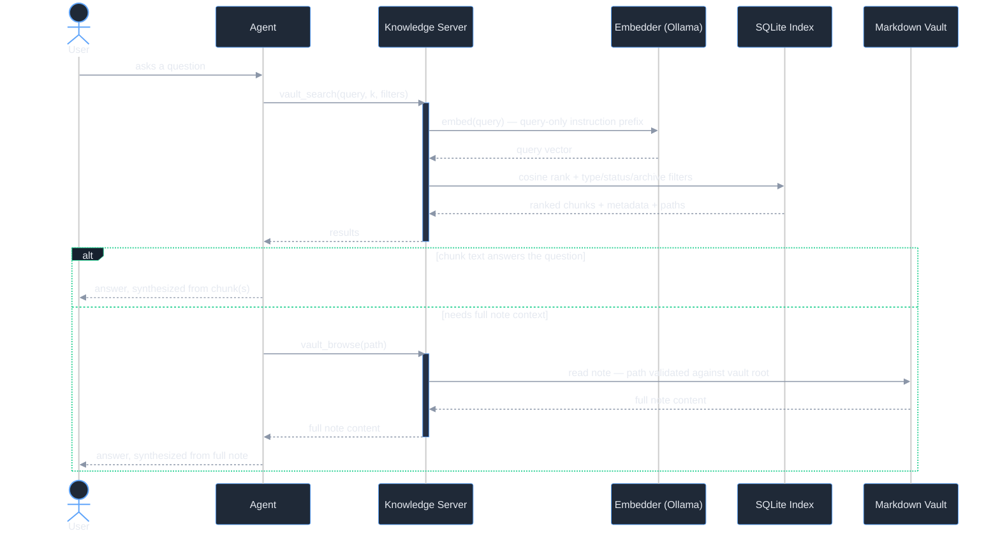
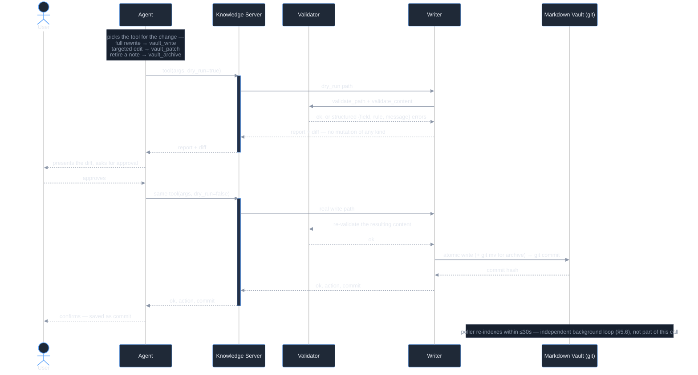

# Architecture Reference

- **Document type:** Canonical architecture specification
- **Status:** Finalized
- **Related:** [KNOWLEDGE-MODEL.md](KNOWLEDGE-MODEL.md) (rationale), [VAULT-SCHEMA.md](VAULT-SCHEMA.md) (note contract), [DEPLOYMENT.md](DEPLOYMENT.md) (ingress + auth)

---

## 1. Overview

The Knowledge Server exposes a governed Markdown knowledge vault to any [MCP](https://modelcontextprotocol.io) client over Streamable HTTP. It provides semantic search, browsing, validated writing (create/overwrite, targeted patch, archive), and index maintenance as six MCP tools. The server binds loopback only; public exposure is delegated to a reverse proxy / tunnel (see DEPLOYMENT.md).

Design stance: **minimal moving parts, local-first, rebuildable.** Embeddings are computed locally; similarity is computed in-process; the search index is a derived cache reconstructable from the vault at any time. No external vector database, no cloud embedding dependency.

---

## 2. Layered model

```
  Access layer      MCP tools over Streamable HTTP (FastMCP)
                    + OAuth 2.1 authorization server
  ───────────────────────────────────────────────────────────
  Index layer       SQLite (vectors + metadata), refreshed by a
                    30s background poller. DERIVED / REBUILDABLE.
  ───────────────────────────────────────────────────────────
  Storage layer     Markdown vault, git-versioned, Dublin Core
                    frontmatter. DURABLE SOURCE OF TRUTH.
```

The separation is load-bearing: the storage layer is the source of truth and survives everything above it; the index is a cache; the access layer is a swappable interface. Any layer above storage can be rebuilt or replaced without data loss.

---

## 3. Components

### 3.1 MCP server (`ks/server.py`)

A FastMCP application over `streamable-http`. Responsibilities:

- Registers the six tools (§4) and the OAuth consent routes.
- Configures transport security (host/origin allow-lists) so only expected hosts and origins are accepted.
- Starts the vault poller as a **daemon thread in `main()`** — deliberately *not* in the FastMCP lifespan hook, which runs per-session under streamable-http and would spawn a poller per connection. Exactly one poller exists for the process lifetime.
- Binds loopback (`127.0.0.1`) only.
- Wraps every tool in `@logged_tool` (§3.8) for a structured, per-call audit line independent of git history.

### 3.2 Embedder (`ks/embed.py`)

Wraps a local [Ollama](https://ollama.com) instance over its HTTP API (via `httpx`) using the `mxbai-embed-large` model (1024-dim). The model card's instruction prefix is applied to **queries only, never documents** — an asymmetry the model requires for correct retrieval. The model is pinned resident (`keep_alive = -1`) to avoid cold-start latency.

### 3.3 Index + search (`ks/db.py`, `ks/indexer.py`, `ks/search.py`)

- **Indexer** walks the vault's index roots, splits notes into heading-aware chunks (bounded target size + overlap so no chunk is silently truncated at the model's context limit), embeds them, and upserts vectors + frontmatter into SQLite. Incremental by content hash: an unchanged pass is stat + hash + one SQL read.
- **Search** embeds the query and ranks chunks by cosine similarity (computed in-process with `numpy`), applying `type` / `status` / archive filters.
- **SQLite** is opened in WAL mode so search readers never block on the poller's writes.

### 3.4 Poller

Runs every 30s: an incremental reindex plus expired-auth-row cleanup. Errors (e.g. the embedding runtime restarting) are logged and retried, never fatal. Worst-case index staleness after a write is one poll interval — which satisfies "retrievable without a manual reindex."

### 3.5 Validator (`ks/validator.py`)

Pure, I/O-free enforcement of the note schema and path rules (see VAULT-SCHEMA.md §3.5). Two independent checks — `validate_path` and `validate_content` — merged into one result. Being pure makes it trivially testable and reusable.

### 3.6 Writer (`ks/writer.py`)

Composes the validator with filesystem-safe I/O, shared across all three write tools:

1. Resolve the target against the **real** vault root and reject anything escaping it (defeats symlink and traversal escapes).
2. `dry_run=True`: validation report + action status (`create`/`overwrite`/`patch`/`archive`) + unified diff. No mutation.
3. `dry_run=False`: atomic write (temp file + `os.replace` in the destination dir) → one git commit under a fixed author, with the originating client recorded in the commit body.

`vault_write` writes the full caller-supplied content. `vault_patch` requires its `old_str` to match exactly once in the current file — zero or multiple matches fail closed rather than guess — and rejects any patch that would change the note's `identifier`. `vault_archive` rewrites only the frontmatter `status` line and uses `git mv` so the note's history follows it to the new `archive/` path. All three re-validate the resulting content against the same schema validator before anything touches disk.

A module-level lock serializes write+commit so two concurrent tool calls cannot race on the git index.

### 3.7 Authorization server (`ks/auth.py`, `ks/setpass.py`)

An embedded OAuth 2.1 provider — see DEPLOYMENT.md §3.

### 3.8 Structured logging (`ks/logging_config.py`)

`configure_logging()` runs as the first statement at import time — before the FastMCP/`AuthSettings` construction — so an import-time startup failure is itself logged rather than crash-looping silently. Every tool is wrapped in `@logged_tool`, which records one JSONL line per call (originating client, tool name, outcome, duration, tool-specific detail) to a rotating file, independent of the git commit trail §3.6 produces. This is a usage/audit log, not the mechanism that keeps the vault correct — that's the validator (§3.5) and the writer's atomic-write-then-commit sequence.

---

## 4. The MCP tools

| Tool | Reads/Writes | Behavior |
|---|---|---|
| `vault_search` | read | Embeds query, cosine-ranks chunks, filters by `type`/`status`; excludes archived/superseded by default. |
| `vault_browse` | read | Lists indexed notes with metadata, or returns one note's full content (path validated against the vault root). |
| `vault_write` | write | Validated create/overwrite. `dry_run` returns report + diff without mutating. Git-committed on real write. |
| `vault_patch` | write | Exact-one-match string replacement on an existing note. Rejects a patch that would change `identifier`. Git-committed on real write. |
| `vault_archive` | write | Moves a note `library/` → `archive/` via `git mv`, setting `status`. History follows the move; git-committed on real write. |
| `vault_reindex` | write (index) | On-demand rebuild; `force=true` re-embeds everything. Serialized against the poller via a lock. |

---

## 5. Data flow

### 5.1 Read (search)

```
client → vault_search(query, filters)
       → embed query (Ollama)
       → cosine rank vs SQLite vectors (numpy, in-process)
       → apply type/status/archive filters
       → return ranked chunks + metadata + source paths
```

The sequence above compresses one important branch: `vault_search` returns chunks, not full notes, and the caller decides whether a chunk is enough to answer or whether it needs the complete document via `vault_browse`. In full:



Nothing in this flow touches the validator or writes to disk. Also note the asymmetry at the embedding step: the query-only instruction prefix is applied here, but *not* when documents were embedded at index time (§5.6) — getting that backwards is a real failure mode (§3.2).

### 5.2 Write

```
client → vault_write(path, content, dry_run=true)
       → validate path + schema (validator)
       → report + diff, NO mutation
   (human approval)
client → vault_write(path, content)              [dry_run=false]
       → resolve target against real vault root
       → atomic write → git add + commit (fixed author, client in body)
       → poller re-indexes within ≤30s
```

### 5.3 Patch

```
client → vault_patch(path, old_str, new_str, dry_run=true)
       → old_str must match exactly once in current content
       → apply replacement, re-validate against schema
       → reject if identifier would change
       → report + diff, NO mutation
   (human approval)
client → vault_patch(path, old_str, new_str, dry_run=false)
       → atomic write → git add + commit
       → poller re-indexes within ≤30s
```

### 5.4 Archive

```
client → vault_archive(path, new_status, dry_run=true)
       → resolve mirrored archive/ destination
       → rewrite frontmatter `status` line, re-validate
       → report + diff, NO mutation
   (human approval)
client → vault_archive(path, new_status, dry_run=false)
       → atomic write → git mv library/... archive/... → commit
       → poller re-indexes within ≤30s
```

### 5.5 The write family, in sequence

`vault_write`, `vault_patch`, and `vault_archive` (§5.2–5.4) are three different payloads over one identical shape: dry-run first, human approves the diff, then a real call that re-validates before it ever touches disk. Rather than repeat the same sequence three times, here it is once, generalized, with what's actually different about each tool called out below the diagram:



What's actually different per tool:

| Tool | What gets validated / written |
|---|---|
| `vault_write` | The **full caller-supplied content**. Validator checks all twelve Schema v1.1 fields fresh, every call. |
| `vault_patch` | `old_str` must match **exactly once** — zero or multiple matches fail closed. Rejects any edit that would change `identifier`. |
| `vault_archive` | Rewrites only the frontmatter `status` line. Writer uses `git mv` — history follows the note to its new `archive/` path. |

Two things worth calling out explicitly: the validator runs **twice** on a real write — once on the dry run (what *will* happen), once again on the actual content at commit time (what's *about to* happen) — the two are never assumed identical. And regardless of which tool ran, the git commit body records the originating OAuth `client_id`, so the audit trail is uniform across all three.

### 5.6 Indexing: the poller and on-demand `vault_reindex`

Both entry points run the exact same `run_index()` (`ks/indexer.py`), serialized through the same `_index_lock` (§3.4, §3.1) so a forced on-demand rebuild and a poll cycle never interleave:

```mermaid
%%{init: {'theme':'dark', 'themeVariables': {'primaryColor':'#1f2937','primaryTextColor':'#e5e9f0','primaryBorderColor':'#60a5fa','lineColor':'#8b96a8','secondaryColor':'#111827','tertiaryColor':'#111827','actorBkg':'#1f2937','actorBorder':'#60a5fa','actorTextColor':'#e5e9f0','signalColor':'#8b96a8','signalTextColor':'#e5e9f0','labelBoxBkgColor':'#17202e','labelBoxBorderColor':'#34d399','labelTextColor':'#e5e9f0','loopTextColor':'#e5e9f0','noteBkgColor':'#17202e','noteTextColor':'#8b96a8','noteBorderColor':'#253045','activationBkgColor':'#253045','activationBorderColor':'#60a5fa'}}}%%
sequenceDiagram
    participant Poller as Poller (daemon thread)
    participant Agent
    participant KS as Knowledge Server
    participant Indexer
    participant Vault as Markdown Vault
    participant Embedder as Embedder (Ollama)
    participant Index as SQLite Index
    participant AuthDB as ks-auth.db

    loop every 30s, forever
        Poller->>KS: acquire _index_lock
        KS->>Indexer: run_index() — incremental
        Indexer->>Vault: scan_vault() — list notes on disk
        Indexer->>Index: indexed_state() — known content hashes
        Note over Indexer: diff by content hash — an unchanged file costs one stat + hash + SQL read
        opt changed or new files found
            Indexer->>Embedder: embed_documents(chunk texts)
            Embedder-->>Indexer: vectors
            Indexer->>Index: replace_file() — upsert vectors + frontmatter
        end
        opt files removed from disk
            Indexer->>Index: remove_file()
        end
        Indexer-->>KS: stats — indexed, unchanged, removed, chunks, elapsed
        KS->>KS: release _index_lock
        Poller->>AuthDB: cleanup_expired() — same cycle, piggybacked
    end

    Note over Agent,KS: on demand, any time — shares the same lock as the loop above
    Agent->>KS: vault_reindex(force)
    KS->>KS: acquire _index_lock — blocks if a poller cycle is already running
    KS->>Indexer: run_index(force=force)
    Note over Indexer: force=true re-embeds every note (e.g. after an embedding-model change);<br/>force=false is one incremental pass, identical to a poller cycle
    Indexer-->>KS: stats
    KS->>KS: release _index_lock
    KS-->>Agent: stats
```

The poller's expired-auth-row cleanup rides along on the same 30s cycle rather than getting its own thread — one more DELETE pass is negligible next to the indexing work already happening.

### 5.7 Authorization: DCR, PKCE, and passphrase consent

The OAuth 2.1 flow (`ks/auth.py`) is the one moving part not otherwise visible in the tool-call diagrams above — every `vault_*` call in §5.1–5.5 assumes a client already has a valid access token, minted here:


The consent step is the one human-gated moment in the whole authorization flow: no client can complete registration → authorization without the operator entering the vault passphrase at `/consent`. The tradeoff named in §7 applies here too — access tokens are stateless JWTs verified without a DB read (fast, but not individually revocable within their TTL); refresh tokens are opaque, DB-stored, and rotate on every use, which is where revocation actually applies.

---

## 6. Key design decisions

- **Loopback-only bind; ingress via proxy/tunnel.** The process never faces the public network directly; TLS termination and DDoS/edge concerns are the proxy's job.
- **Poller over filesystem-watch.** A poll loop is simpler and dependency-free; at vault scale an unchanged pass costs milliseconds, so the tradeoff (≤30s staleness) is negligible.
- **In-process similarity, no vector DB.** At this corpus scale, `numpy` over SQLite-stored vectors is sufficient and removes an entire class of operational dependency. This is a scale-appropriate choice, not a universal one (see §7).
- **Derived index.** The index is never authoritative; losing it is a rebuild, not data loss.
- **Enforce at write.** Correctness is a write-time invariant, not a read-time hope.

---

## 7. Constraints, assumptions, and failure modes

- **Scale assumption.** In-process cosine ranking and a poll-based indexer suit a small-to-moderate vault (order 10²–10³ notes). At much larger scale, the index layer would be swapped for a dedicated vector store — which the layered model permits without touching storage or access layers. This is the primary known scaling boundary.
- **Embedding runtime dependency.** If Ollama is down, search and write-indexing degrade; the poller logs and retries, and writes still succeed (the index catches up when the runtime returns). Writes are never blocked by index availability.
- **Single-writer serialization.** The write lock assumes one process. Horizontal scaling of the writer would require a different concurrency model; it is out of scope by design.
- **Model asymmetry.** The query-only instruction prefix is model-specific; swapping embedding models requires re-checking this and a full re-embed (`vault_reindex force=true`), since vector spaces are not comparable across models.
- **Staleness window.** Up to one poll interval between a write and its searchability. Acceptable by design; `vault_reindex` forces immediate refresh if ever needed.
